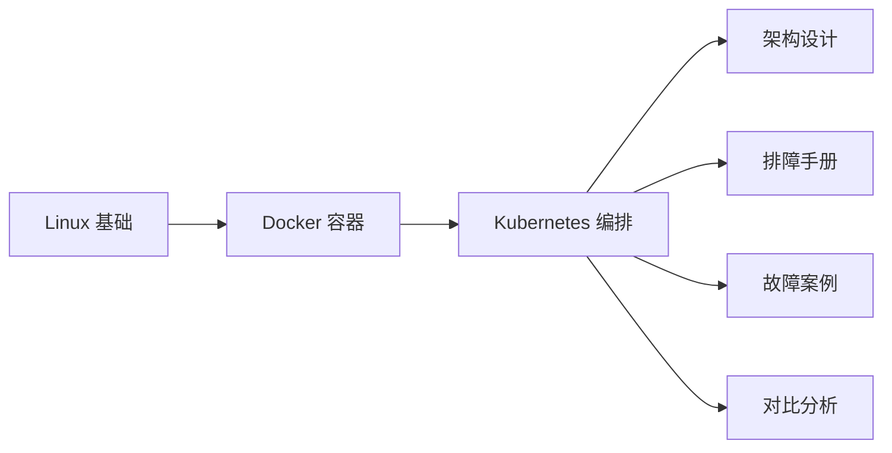
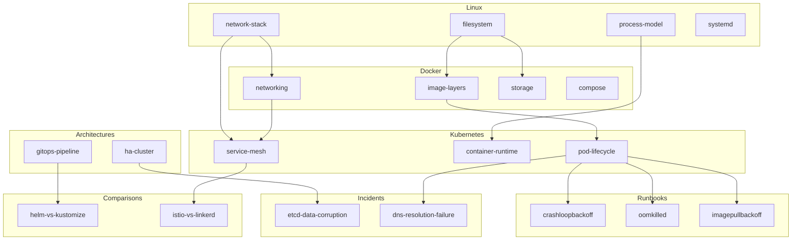

# SRE Atlas 项目规划

## 执行计划 + 当前进度

### Phase 1: 骨架搭建 ✅ 已完成

```
✅ Task 1: 项目初始化（Astro + React + Tailwind + MDX）
   ├── ✅ astro.config.mjs（React + MDX + wikilinks 插件）
   ├── ✅ package.json + 依赖安装
   └── ✅ .gitignore + .env

✅ Task 2: 设计系统
   ├── ✅ OKLCH 色彩 token（暗色/亮色双主题）
   ├── ✅ 自托管字体（Inter Variable + JetBrains Mono woff2）
   ├── ✅ 品牌 favicon（钴蓝色罗盘 SVG）
   ├── ✅ 排版系统（字号、行高、字间距）
   ├── ✅ 间距、圆角、动效 token
   └── ✅ 全局重置 + 组件工具类（.prose, .code-block, .admonition, .table）

✅ Task 3: 布局 + 交互组件
   ├── ✅ BaseLayout（header + sidebar + TOC + 移动端适配）
   ├── ✅ ThemeToggle（暗色/亮色切换，localStorage 持久化）
   ├── ✅ SearchDialog（Ctrl+K 搜索，键盘导航）
   ├── ✅ PagefindSearch（Pagefind 全文搜索，支持中文）
   ├── ✅ Mermaid（React 组件，读取 CSS 变量适配主题）
   ├── ✅ Admonition（MDX 组件，note/tip/warning/error）
   ├── ✅ TOC（IntersectionObserver 高亮当前标题）
   ├── ✅ LastModified（最后修改日期）
   └── ✅ wikilinks remark 插件（[[slug]] → 链接）

✅ Task 4: 内容页面（21 篇）
   ├── ✅ index.astro（首页：hero + 快速入口卡片）
   ├── ✅ linux/（4 篇：process-model, filesystem, network-stack, systemd）
   ├── ✅ docker/（4 篇：image-layers, networking, storage, compose）
   ├── ✅ kubernetes/（3 篇：pod-lifecycle, container-runtime, service-mesh）
   ├── ✅ runbooks/（3 篇：crashloopbackoff, oomkilled, imagepullbackoff）
   ├── ✅ architectures/（2 篇：ha-cluster, gitops-pipeline）
   ├── ✅ incidents/（2 篇：etcd-data-corruption, dns-resolution-failure）
   └── ✅ comparisons/（2 篇：helm-vs-kustomize, istio-vs-linkerd）

✅ Task 5: 部署配置
   ├── ✅ Dockerfile（两阶段构建：node:22-alpine → nginx:alpine）
   ├── ✅ nginx.conf（gzip + 缓存 + 安全头 + SPA fallback）
   ├── ✅ .dockerignore
   ├── ✅ .github/workflows/deploy.yml（构建 → GHCR → 部署）
   └── ✅ infra/k8s/（namespace + deployment + service + ingress + network-policy）

✅ Task 6: Neon PostgreSQL Schema
   └── ✅ 创建 3 张表（ingested_urls, wiki_pages, source_health）

✅ Task 7: 验证
   ├── ✅ astro build（21 页面，零错误）
   └── ✅ dev server 运行验证
```

### Phase 2: Agent 采集 ✅ 已完成

```
✅ sre-atlas-agent 仓库搭建
   ├── ✅ config/sources.yaml（6 RSS + 3 GitHub + 2 Docs）
   ├── ✅ config/settings.py（数据库、API、采集参数）
   ├── ✅ config/database.sql（3 张表 schema）
   ├── ✅ requirements.txt + .env.example + .gitignore
   └── ✅ README.md

✅ RSS + GitHub 采集器
   ├── ✅ agent/collectors/rss_collector.py（feedparser + 重试 + 去重）
   └── ✅ agent/collectors/github_collector.py（REST API + 分页 + 限流）

✅ LLM 生成 pipeline
   └── ✅ agent/generator.py（Claude API + 质量门控 + 批处理）

✅ 去重 + 调度 + 入口
   ├── ✅ agent/dedup.py（PostgreSQL 去重）
   ├── ✅ agent/scheduler.py（定时采集）
   └── ✅ agent/main.py（CLI 入口，支持 --once / --dry-run）
```

### Phase 3: 上云部署（之后）

```
⬜ Cloudflare DNS → wiki.tentative.me
⬜ k3s 集群部署
⬜ cert-manager + HTTPS
⬜ 监控集成
```

---

## 文件树

```
wiki-react/
├── astro.config.mjs
├── package.json
├── Dockerfile + nginx.conf + .dockerignore
├── .github/workflows/deploy.yml
├── infra/k8s/
│   ├── namespace.yaml
│   ├── deployment.yaml
│   ├── service.yaml
│   ├── ingress.yaml
│   └── network-policy.yaml
├── public/
│   ├── favicon.svg
│   └── fonts/（6 个 woff2 文件）
├── src/
│   ├── styles/design-system.css（OKLCH tokens，433 行）
│   ├── layouts/BaseLayout.astro
│   ├── components/
│   │   ├── react/
│   │   │   ├── ThemeToggle.tsx
│   │   │   ├── SearchDialog.tsx
│   │   │   ├── PagefindSearch.tsx
│   │   │   └── Mermaid.tsx
│   │   ├── astro/
│   │   │   ├── TOC.astro
│   │   │   └── LastModified.astro
│   │   └── mdx/
│   │       └── Admonition.astro
│   ├── lib/remark-wikilinks.mjs
│   └── pages/
│       ├── index.astro
│       ├── linux/（4 篇 .mdx）
│       ├── docker/（4 篇 .mdx）
│       ├── kubernetes/（3 篇 .mdx）
│       ├── runbooks/（3 篇 .mdx）
│       ├── architectures/（2 篇 .mdx）
│       ├── incidents/（2 篇 .mdx）
│       └── comparisons/（2 篇 .mdx）
└── dist/（构建输出）
```

---

## 知识图谱（wikilinks 连接）

### 纵向学习路径（Linux → Docker → Kubernetes）



### 页面级连接



---

## 技术栈

| 层 | 技术 | 用途 |
|----|------|------|
| 站点生成 | Astro 6.x + MDX | 静态站点，Markdown/MDX → HTML |
| 交互组件 | React 19 | 主题切换、搜索、Mermaid 等 |
| 样式 | Tailwind v4 + OKLCH 设计系统 | 原子化 CSS + 设计 token |
| 搜索 | Pagefind | 静态全文搜索，支持中文 |
| Wikilinks | 自定义 remark 插件 | `[[slug]]` 语法，知识图谱 |
| 图表 | Mermaid (React 组件) | 架构图、流程图 |
| 数据库 | Neon PostgreSQL (SaaS) | Agent 去重、状态追踪 |
| 容器 | nginx:alpine | 静态站点服务 |
| 编排 | k3s | 轻量 Kubernetes |
| Ingress | Traefik (k3s 内置) | HTTP 路由 + TLS |
| 证书 | cert-manager + Let's Encrypt | 自动 HTTPS |
| 网络 | Tailscale | 节点间 mesh VPN |
| CDN | Cloudflare | DNS + CDN + DDoS 防护 |
| CI/CD | GitHub Actions | 自动构建 + 部署 |
| 镜像仓库 | GHCR | Docker 镜像存储 |
| Agent | Python + feedparser + Claude API | 内容采集 + 生成 |
| 监控 | Prometheus + Grafana + Loki | 可观测性 |

---

## 域名规划

| 服务 | 域名 | 用途 |
|------|------|------|
| SRE Atlas | `wiki.tentative.me` | 知识库主站 |
| 备用 | `*.tentativr.tech` | 实验性服务 |
| 国内 | `pineapple-user.site` | 备案域名，未来国内服务 |

## 成本

| 项目 | 月成本 | 备注 |
|------|--------|------|
| DO k3s 集群 | ~$96 | 学生包 |
| Neon PostgreSQL | $0 | 512MB 免费额度 |
| Cloudflare | $0 | Free plan |
| AI Agent | ~$21 | Claude API |
| 域名 | ~$2.5 | tentative.me + tentativr.tech |
| **总计** | **~$119.5/月** | 国内节点一次性付费不计入 |
