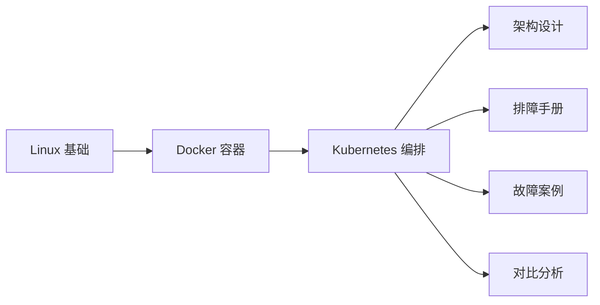
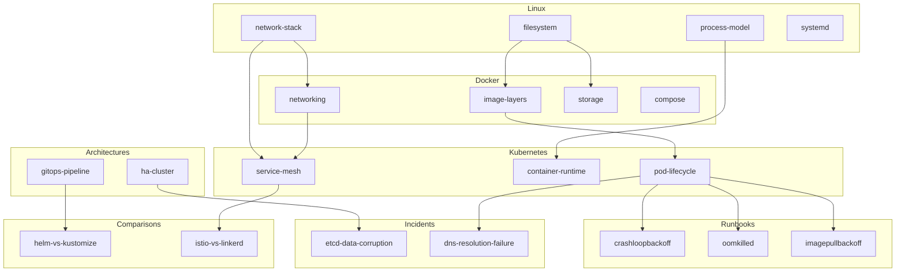

# SRE Atlas 项目规划

## 执行计划 + 当前进度

### Phase 1: 骨架搭建 ✅ 已完成

```
✅ Task 1: 项目初始化 + MkDocs 配置
   ├── ✅ git init + remote (sre-wiki)
   ├── ✅ mkdocs.yml（i18n 中文默认 + ezlinks + mermaid）
   ├── ✅ requirements.txt
   └── ✅ .gitignore + .env

✅ Task 2: 目录结构 + 分类首页
   ├── ✅ wiki/zh/index.md（主页）
   ├── ✅ wiki/zh/linux/index.md
   ├── ✅ wiki/zh/docker/index.md
   ├── ✅ wiki/zh/kubernetes/index.md
   ├── ✅ wiki/zh/runbooks/index.md
   ├── ✅ wiki/zh/architectures/index.md
   ├── ✅ wiki/zh/incidents/index.md
   └── ✅ wiki/zh/comparisons/index.md

✅ Task 3: 元数据层
   └── ✅ _meta/SCHEMA.md（标签体系 + 写作规范）

✅ Task 4: 数据源配置
   └── ✅ scripts/sources.yaml

✅ Task 5: Linux/Docker 种子页面（8 篇）
   ├── ✅ linux/process-model.md
   ├── ✅ linux/filesystem.md
   ├── ✅ linux/network-stack.md
   ├── ✅ linux/systemd.md
   ├── ✅ docker/image-layers.md
   ├── ✅ docker/networking.md
   ├── ✅ docker/storage.md
   └── ✅ docker/compose.md

✅ Task 6: Kubernetes 种子页面（12 篇）
   ├── ✅ kubernetes/pod-lifecycle.md
   ├── ✅ kubernetes/container-runtime.md
   ├── ✅ kubernetes/service-mesh.md
   ├── ✅ runbooks/crashloopbackoff.md
   ├── ✅ runbooks/oomkilled.md
   ├── ✅ runbooks/imagepullbackoff.md
   ├── ✅ architectures/ha-cluster.md
   ├── ✅ architectures/gitops-pipeline.md
   ├── ✅ incidents/etcd-data-corruption.md
   ├── ✅ incidents/dns-resolution-failure.md
   ├── ✅ comparisons/helm-vs-kustomize.md
   └── ✅ comparisons/istio-vs-linkerd.md

✅ Task 7: Neon PostgreSQL Schema
   └── ✅ 创建 3 张表（ingested_urls, wiki_pages, source_health）

✅ Task 8: GitHub Actions CI/CD
   └── ✅ .github/workflows/deploy.yml

✅ Task 9: k8s 部署清单
   ├── ✅ infra/k8s/wiki-namespace.yaml
   ├── ✅ infra/k8s/wiki-deployment.yaml
   ├── ✅ infra/k8s/wiki-service.yaml
   ├── ✅ infra/k8s/wiki-ingress.yaml
   └── ✅ infra/k8s/network-policy.yaml

✅ Task 10: Dockerfile + nginx.conf
   ├── ✅ infra/docker/Dockerfile
   └── ✅ infra/docker/nginx.conf

✅ Task 11: 验证 + 提交 + 推送
   ├── ✅ mkdocs build 验证（零警告零错误）
   ├── ✅ git commit（2 commits: init + fix nav）
   └── ✅ push 到 GitHub（github-lin327:lin327/sre-wiki.git）
```

### Phase 2: Agent 采集（之后）

```
⬜ sre-atlas-agent 仓库搭建
⬜ RSS/GitHub/Docs 采集器
⬜ LLM 生成 pipeline
⬜ 去重 + 质量门控
```

### Phase 3: 上云部署（之后）

```
⬜ Cloudflare DNS → wiki.tentative.me
⬜ k3s 集群部署
⬜ cert-manager + HTTPS
⬜ 监控集成
```

---

## 文件树（最终状态）

```
sre-wiki/
├── mkdocs.yml
├── requirements.txt
├── .gitignore
├── .env                          ← gitignore
├── PROJECT.md
├── PLAN.md                       ← 本文件
├── .github/workflows/deploy.yml
├── wiki/
│   ├── zh/                       ← 默认语言
│   │   ├── index.md
│   │   ├── assets/images/
│   │   ├── linux/
│   │   │   ├── index.md
│   │   │   ├── process-model.md
│   │   │   ├── filesystem.md
│   │   │   ├── network-stack.md
│   │   │   └── systemd.md
│   │   ├── docker/
│   │   │   ├── index.md
│   │   │   ├── image-layers.md
│   │   │   ├── networking.md
│   │   │   ├── storage.md
│   │   │   └── compose.md
│   │   ├── kubernetes/
│   │   │   ├── index.md
│   │   │   ├── pod-lifecycle.md
│   │   │   ├── container-runtime.md
│   │   │   └── service-mesh.md
│   │   ├── runbooks/
│   │   │   ├── index.md
│   │   │   ├── crashloopbackoff.md
│   │   │   ├── oomkilled.md
│   │   │   └── imagepullbackoff.md
│   │   ├── architectures/
│   │   │   ├── index.md
│   │   │   ├── ha-cluster.md
│   │   │   └── gitops-pipeline.md
│   │   ├── incidents/
│   │   │   ├── index.md
│   │   │   ├── etcd-data-corruption.md
│   │   │   └── dns-resolution-failure.md
│   │   └── comparisons/
│   │       ├── index.md
│   │       ├── helm-vs-kustomize.md
│   │       └── istio-vs-linkerd.md
│   └── en/                       ← 未来扩展
├── _meta/
│   └── SCHEMA.md
├── scripts/
│   └── sources.yaml
└── infra/
    ├── docker/
    │   ├── Dockerfile
    │   └── nginx.conf
    └── k8s/
        ├── wiki-namespace.yaml
        ├── wiki-deployment.yaml
        ├── wiki-service.yaml
        ├── wiki-ingress.yaml
        └── network-policy.yaml
```

---

## 知识图谱（wikilinks 连接）

### 纵向学习路径（Linux → Docker → Kubernetes）



### 页面级连接



---

## 域名规划

| 服务 | 域名 | 用途 |
|------|------|------|
| SRE Atlas | `wiki.tentative.me` | 知识库主站 |
| 备用 | `*.tentativr.tech` | 实验性服务 |
| 国内 | `pineapple-user.site` | 备案域名，未来国内服务 |

## 成本

| 项目 | 月成本 | 备注 |
|------|--------|------|
| DO k3s 集群 | ~$96 | 学生包 |
| Neon PostgreSQL | $0 | 512MB 免费额度 |
| Cloudflare | $0 | Free plan |
| AI Agent | ~$21 | Claude API |
| 域名 | ~$2.5 | tentative.me + tentativr.tech |
| **总计** | **~$119.5/月** | 国内节点一次性付费不计入 |

## 技术栈

| 层 | 技术 | 用途 |
|----|------|------|
| 站点生成 | MkDocs Material 9.x | 静态站点，Markdown → HTML |
| Wikilinks | mkdocs-ezlinks-plugin | `[[slug]]` 语法，知识图谱 |
| i18n | mkdocs-static-i18n | 中文（默认）+ 英文（未来） |
| 图表 | Mermaid (mkdocs-mermaid2-plugin) | 架构图、流程图 |
| 数据库 | Neon PostgreSQL (SaaS) | Agent 去重、状态追踪 |
| 容器 | nginx:alpine | 静态站点服务 |
| 编排 | k3s | 轻量 Kubernetes |
| Ingress | Traefik (k3s 内置) | HTTP 路由 + TLS |
| 证书 | cert-manager + Let's Encrypt | 自动 HTTPS |
| 网络 | Tailscale | 节点间 mesh VPN |
| CDN | Cloudflare | DNS + CDN + DDoS 防护 |
| CI/CD | GitHub Actions | 自动构建 + 部署 |
| Agent | Python + feedparser + Claude API | 内容采集 + 生成 |
| 镜像仓库 | GHCR (GitHub Container Registry) | Docker 镜像存储 |
| 监控 | Prometheus + Grafana + Loki | 可观测性 |
