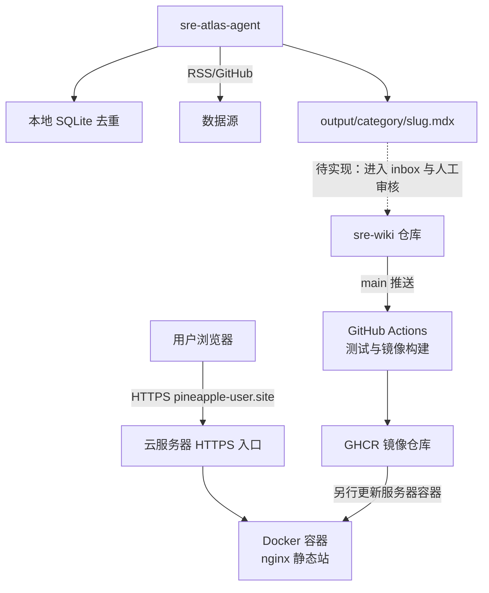

# SRE Atlas

AI 驱动的运维知识库，覆盖 Linux → Docker → Kubernetes 全链路。

## 定位

**SRE Atlas** 是一个结构化的运维知识图库，目标是：

- **学习路径**：从 Linux 基础到容器化再到编排，覆盖运维工程师成长全链路
- **实战沉淀**：真实故障案例、排障手册、架构设计，而非理论堆砌
- **AI 增强**：Agent 自动从 RSS/GitHub/官方文档采集内容，持续更新
- **知识图谱**：wikilinks 连接相关概念，形成可导航的知识网络

## 技术架构



当前采集器仅实现 RSS 和 GitHub，官方文档采集仍属规划。CI 只推送镜像，不自动更新云服务器；Agent 也没有自动同步 Wiki 的已实现链路。

## 技术栈

| 层 | 技术 | 用途 |
|----|------|------|
| 站点生成 | Astro 6.x + MDX | 静态站点，Markdown/MDX → HTML |
| 交互组件 | React 19 | 主题切换、搜索、Mermaid 等交互组件 |
| 样式 | Tailwind v4 + OKLCH 设计系统 | 原子化 CSS + 自定义设计 token |
| 搜索 | Pagefind | 静态全文搜索，支持中文 |
| Wikilinks | 自定义 remark 插件 | `[[slug]]` 语法，知识图谱 |
| 图表 | Mermaid (React 组件) | 架构图、流程图 |
| Agent 持久化 | SQLite | 本地去重、状态追踪 |
| 认证 | Better Auth / Neon Auth | Wiki 登录会话，与 Agent 去重分离 |
| 容器 | Node 22 构建 + nginx:alpine | Docker 多阶段构建、静态站点服务 |
| 部署 | 云服务器 Docker | 接入服务器现有 HTTPS 入口 |
| 镜像仓库 | GHCR (GitHub Container Registry) | Docker 镜像存储 |
| CI | GitHub Actions | 单元测试、镜像构建与推送；不含服务器部署 |
| Agent | Python + feedparser + Claude API | 内容采集 + 生成 |
| 赞助槽位 | Astro AdSlot | 仅 sponsor 本地图与链接，`PUBLIC_ADS_ENABLED=false` 默认关闭 |

## 内容分类

| 分类 | 目录 | 内容 |
|------|------|------|
| Linux 基础 | `src/pages/linux/` | 进程模型、文件系统、网络栈、systemd |
| Docker | `src/pages/docker/` | 镜像分层、网络模式、存储驱动、Compose |
| Kubernetes | `src/pages/kubernetes/` | Pod 生命周期、Service Mesh、容器运行时 |
| 排障手册 | `src/pages/runbooks/` | CrashLoopBackOff、OOMKilled、ImagePullBackOff |
| 架构设计 | `src/pages/architectures/` | 高可用集群、GitOps 流水线 |
| 故障案例 | `src/pages/incidents/` | etcd 数据损坏、DNS 解析失败 |
| 对比分析 | `src/pages/comparisons/` | Helm vs Kustomize、Istio vs Linkerd |

目标边界：`src/pages/` 发布审核后的精选内容，`src/inbox/` 接收待整理草稿，Issue 默认不上线。当前 20 篇种子正文和 7 个分类索引已标记 `canonical: true`，分类列表区分精选与待整理，首页统计 20 篇精选。`src/inbox/` 接入与全站发布过滤尚未实现，历史生成页仍可访问并被搜索或 sitemap 收录。详见[内容契约](CONTENT_CONTRACT.md)。

## 标签体系

### 技术栈层级

- `layer/kernel` — Linux 内核
- `layer/filesystem` — 文件系统
- `layer/process` — 进程模型
- `layer/network-stack` — 网络栈
- `layer/systemd` — 服务管理
- `layer/l4-network` — 传输层
- `layer/dns` — DNS

### 组件

- `component/containerd` — 容器运行时
- `component/docker-engine` — Docker 引擎
- `component/network-overlay` — 覆盖网络
- `component/storage-driver` — 存储驱动
- `component/control-plane` — K8s 控制面
- `component/data-plane` — K8s 数据面
- `component/networking` — K8s 网络
- `component/storage` — K8s 存储
- `component/security` — 安全
- `component/observability` — 可观测性
- `component/cicd` — CI/CD
- `component/infrastructure` — 基础设施

### 工具

- `tool/iptables` — iptables
- `tool/nftables` — nftables
- `tool/perf` — 性能工具

### 模式

- `pattern/compose` — Docker Compose

### 主题

- `topic/concept` — 概念
- `topic/troubleshooting` — 排障
- `topic/architecture` — 架构
- `topic/best-practice` — 最佳实践
- `topic/comparison` — 对比
- `topic/incident` — 故障案例
- `topic/performance` — 性能优化
- `topic/security` — 安全

### 技术

- `tech/kubernetes`, `tech/docker`, `tech/helm`, `tech/prometheus`
- `tech/grafana`, `tech/argocd`, `tech/terraform`, `tech/ansible`
- `tech/etcd`, `tech/envoy`, `tech/cilium`

### 严重程度（runbook / incident 专用）

- `severity/p0` — 集群不可用 / 数据丢失
- `severity/p1` — 服务降级 / 部分用户受影响
- `severity/p2` — 非核心功能异常
- `severity/p3` — 告警 / 预警

## 写作规范

### 语言风格

- 默认语言：中文
- 技术术语保持英文：CrashLoopBackOff、Pod、etcd、Service Mesh、livenessProbe 等
- 命令和代码块保持原样：`kubectl get pods`、`docker build -t ...`
- 中文描述 + 英文术语，符合国内 SRE 社区阅读习惯
- 英文内容已位于 `src/pages/en/`；当前仍优先维护中文精选内容

### Frontmatter

```yaml
---
title: "页面标题（中文描述 + 英文术语）"
created: YYYY-MM-DD
updated: YYYY-MM-DD
type: concept | runbook | architecture | incident | comparison | fundamental
tags: [from taxonomy above]
sources: [url1, url2]
confidence: high | medium | low
---
```

### 命名规范

- 文件名：小写，连字符分隔（`pod-lifecycle.mdx`）
- Slug 全局唯一，不同目录下不能同名
- 使用 `[[slug]]` 或 `[[slug|中文名]]` 链接页面
- 每个页面至少 2 个出站 wikilinks

### Confidence 等级

| 值 | 条件 |
|------|------|
| `high` | ≥2 个独立来源交叉验证 |
| `medium` | 单源但来源可靠（官方文档） |
| `low` | Agent 从单篇博客提取，未经交叉验证 |

## 仓库结构

### sre-wiki（知识库 + 部署）

```
sre-wiki/
├── astro.config.mjs
├── package.json
├── package-lock.json
├── .gitignore
├── PROJECT.md
├── CONTENT_CONTRACT.md        ← 精选、inbox 与历史内容过渡边界
├── .github/workflows/deploy.yml
├── src/
│   ├── pages/                 ← 中文默认无语言前缀；MDX + Astro 路由
│   │   ├── index.astro
│   │   ├── linux/
│   │   ├── docker/
│   │   ├── kubernetes/
│   │   ├── runbooks/
│   │   ├── architectures/
│   │   ├── incidents/
│   │   ├── comparisons/
│   │   ├── en/                ← 已有英文内容，/en/ 前缀
│   │   ├── privacy.mdx
│   │   └── about.mdx
│   ├── components/            ← 含 ads/AdSlot.astro
│   ├── layouts/
│   ├── lib/
│   └── styles/
├── public/
├── .env.example               ← 公开构建配置，广告默认关闭
├── Dockerfile
├── nginx.conf                 ← 实际 Docker 配置
└── infra/
    ├── docker/                ← 历史配置，非当前根 Dockerfile 入口
    └── k8s/                   ← 历史部署资料
```

### sre-atlas-agent（采集 Agent）

```
sre-atlas-agent/
├── agent/
│   ├── collectors/
│   │   ├── rss_collector.py
│   │   └── github_collector.py
│   ├── main.py
│   ├── category_map.py
│   ├── generator.py
│   ├── dedup.py
│   └── scheduler.py
├── config/
│   ├── sources.yaml
│   └── settings.py
├── tests/
├── .github/workflows/
├── requirements.txt
├── .env.example
└── README.md
```

## 域名

| 服务 | 域名 | 用途 |
|------|------|------|
| SRE Atlas | [pineapple-user.site](https://pineapple-user.site/) | 已上线知识库主站 |

## 历史预算（非现网账单）

以下保留旧 k3s 方案的预算记录，不代表当前云服务器 Docker 部署的资源或费用；现网成本需依据实际账单重新核对。

| 项目 | 月成本 | 备注 |
|------|--------|------|
| DO k3s 集群 | ~$96 | 学生包 |
| Neon PostgreSQL | $0 | 512MB 免费额度 |
| Cloudflare | $0 | Free plan |
| AI Agent | ~$21 | Claude API |
| 域名 | ~$2.5 | tentative.me + tentativr.tech |
| **总计** | **~$119.5/月** | 国内节点一次性付费不计入 |

## 当前实现与待完成链路

- 已具备：Astro + React + MDX 结构、首页种子页入口、Pagefind、Docker 静态镜像、默认关闭的 sponsor 槽位与说明页。
- 已具备：Agent RSS/GitHub 采集、Claude 生成 MDX、SQLite 去重；产物仍写入 Agent 的 `output/<category>/`。
- 已具备：Wiki CI 测试与 GHCR 镜像推送；这不等于服务器自动部署。
- 已具备：种子与分类索引的 `canonical` 标注、分类精选置顶和待整理提示；全站发布过滤仍待实现。
- 待完成：Agent 只进 inbox、审核后同步 Wiki、采集状态跨 CI 运行持久化。
- 待完成：镜像发布后的服务器自动部署与上线验证。

### 后续优化

- [ ] 压力测试（k6）
- [ ] 英文内容完善（`src/pages/en/`）
- [ ] 搜索优化
- [ ] 性能调优
