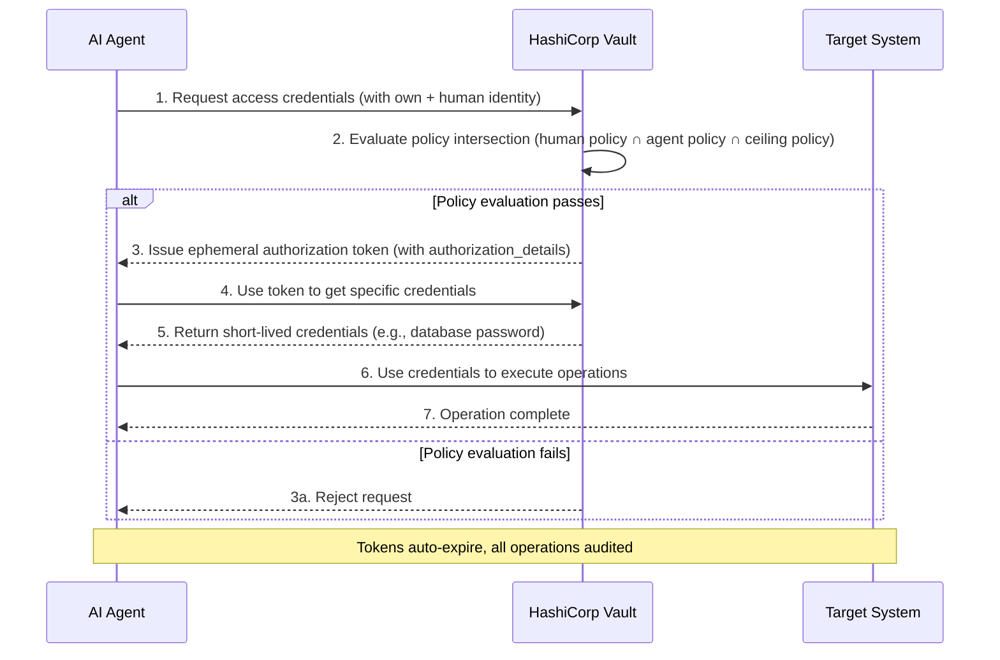

---

layout: ../../../layouts/BaseLayout.astro
title: "Native AI Agent Support in HashiCorp Vault"
category: "Identity and Access Management"
confidence: low
---

# Native AI Agent Support in HashiCorp Vault

## Overview

As organizations integrate AI Agents into production environments, traditional Identity and Access Management (IAM) models face severe challenges. Traditional IAM is designed for deterministic users and workflows, relying on static keys and broad API tokens, making it difficult to implement the principle of least privilege for non-deterministic autonomous agents. When agents operate in On-Behalf-Of mode, they inherit broad permissions, creating security risks of long-term access and over-authorization. HashiCorp Vault's native AI agent support is designed to provide a new security model for the autonomous systems era, enabling runtime identity verification, bounded delegation, and authorization to effectively manage risks from these new Non-Human Identities (NHI).

## Core Concepts

Vault's AI agent support introduces three interconnected core components that together build a framework designed for agent workflows.

### Agent Registry
The Agent Registry allows developers to register and manage agent activities separately from human users and traditional non-human identities. This is the framework's starting point, providing agents with independent identity. In the delegation flow, when agents use the "on-behalf-of" pattern to obtain authorization from human users, the registry can clearly track this delegation relationship, laying the foundation for subsequent authorization, credential management, and observability.

### Identity-Based Fine-Grained Policies
Implementing least privilege for agents is critical. Vault manages agent activities through policy-driven runtime controls, embodied in a "policy intersection" model. Whether an operation is allowed depends on whether it exists simultaneously in the intersection of three policy sets:
1. **Human Owner Policy**: Whether the human user themselves has access permissions.
2. **Agent Baseline Access Policy**: The base permissions granted to the agent as an independent entity.
3. **Ceiling Policies**: This is the key layer specifically for delegation flows, defining the absolute maximum permission boundary an agent can have when acting on behalf of a human -- the "blast radius."

This model ensures that even with unpredictable agent behavior, deterministic guardrails provide constraints.

### Ephemeral Authorization
While policy intersection defines the agent's action ceiling, ephemeral authorization further narrows each access scope to a single request or workflow. This mechanism is built into authorization tokens, based on OAuth 2.0's "Rich Authorization Request" specification. The authorization server specifies particular permissions in the JWT's `authorization_details` claim, binding permissions to the token lifecycle. After token expiration, the agent can no longer execute operations. This request-transaction-context-based evaluation provides finer-grained resource control than entity-based policies alone.

## Practice

In actual deployment, AI agents accessing Vault-protected resources follow this architectural flow, which closely integrates identity, delegation, and real-time policy evaluation:

1. **Agent Request Initiation**: The AI agent needs to access credentials or secrets for the target system (e.g., database, API).
2. **Delegation and Identity Verification**: The agent initiates a request on behalf of a user, with its own agent identity (from the Agent Registry) and the represented human identity jointly submitted to Vault for authentication.
3. **Multi-Dimensional Policy Evaluation**: Vault receives the request and performs real-time policy evaluation. It checks whether the request content falls within the intersection of **human policies**, **agent baseline policies**, and **ceiling policies**. Ceiling policies set an insurmountable permission ceiling.
4. **Authorization and Token Issuance**: If the request passes policy evaluation, Vault issues an ephemeral, narrowly scoped authorization token. The token's `authorization_details` claim explicitly limits the specific operations (e.g., `read`) and resource paths (e.g., `secrets/my-secret`) for this access.
5. **Credential Retrieval and Execution**: The agent uses this ephemeral token to retrieve the required credentials from Vault, then uses those credentials to access the target system. The entire process requires no independent token exchange, reducing operational complexity.
6. **Audit and Logout**: All operations are explicitly recorded and audited. After token expiration, it automatically becomes invalid, and the agent can no longer use it for any operation, achieving "use once and destroy" access.

## SRE Essentials

### Relationship to Reliability, Observability, and Incident Response
- **Reliability**: This model significantly reduces the blast radius from agent errors or compromise by enforcing least privilege and short-lived credentials. It avoids the risk of a broadly permissioned token leak compromising the entire system, thereby enhancing overall system reliability.
- **Observability**: The Agent Registry and request-based authorization provide clear attribution and complete audit trails for every agent behavior. This greatly enhances runtime observability, allowing SRE teams to precisely track which agent, acting on behalf of which user, performed what operation at what time, providing critical context for fault analysis and security investigations.
- **Incident Response**: In security events, SRE can quickly contain threats by revoking specific agent registrations or immediately shortening their token TTLs. Clear audit logs make incident traceability and response measures more precise and effective.

### Best Practices and Common Anti-Patterns
**Best Practices**:
- **Enforce Ceiling Policies**: Regardless of other policy configurations, clear ceiling policies must be defined to absolutely limit agent permission scope.
- **Embrace Ephemeral Authorization**: Use request-based ephemeral authorization wherever possible instead of long-lived static tokens for true least privilege and zero trust.
- **Clarify Delegation Relationships**: Ensure all agent operations go through registered "on-behalf-of" patterns, maintaining clear visibility of human owners.

**Common Anti-Patterns**:
- **Letting Agents Inherit Full Human Permissions**: This is one of the biggest risks, giving agents far more access than their tasks require.
- **Using Long-Term API Tokens**: Configuring long-lived, broad tokens for agents makes them persistent attack targets.
- **Lack of Auditing**: Failing to associate agent operations with specific identities and contexts creates security blind spots.

### Related Metrics (SLI/SLO/SLA)
To ensure this security mechanism's reliability, the following key metrics should be monitored:
- **SLI**: Policy evaluation request success rate, authorization token issuance latency, token issuance failure rate, transaction-based authorization detailed rejection rate.
- **SLO**: Ensure policy evaluation latency stays within acceptable range (e.g., < 50ms P99) to avoid impacting agent workflow efficiency; ensure high availability of authorization token issuance service (e.g., 99.9% uptime).
- **SLA**: For customers using Vault managed services, contract commitments for overall authorization service availability and performance can be defined.

This capability marks the evolution of secret management toward runtime trust governance, critical for building secure, reliable AI agent platforms. For more information, see [[zero-trust-security]] and [[least-privilege]].