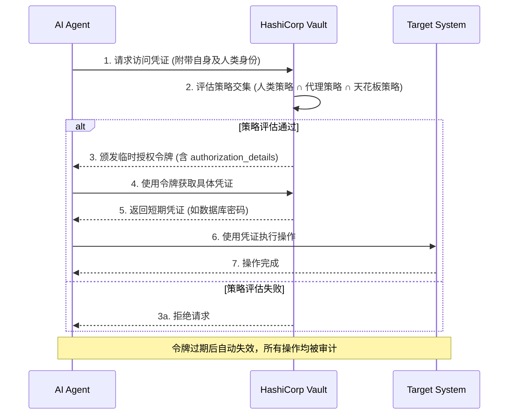

---

layout: ../../layouts/BaseLayout.astro
title: "HashiCorp Vault 中的 AI 代理原生支持"
description: "探讨 HashiCorp Vault 如何通过代理注册表、细粒度策略和临时授权，为自主 AI 代理提供安全模型。"
category: 身份与访问管理
order: 0
lastUpdated: 2026-05-13
confidence: high
sources:
  - url: https://www.hashicorp.com/blog/announcing-native-ai-agent-support-in-hashicorp-vault
    title: "Announcing native AI agent support in HashiCorp Vault"
tags: [ai-agents, vault, iam, security, ephemeral-authorization]
---

# HashiCorp Vault 中的 AI 代理原生支持

## 概述

随着组织将 AI 代理（AI Agents）整合到生产环境中，传统的身份与访问管理（IAM）模型面临严峻挑战。传统 IAM 为确定性用户和工作流设计，依赖静态密钥和宽泛的 API 令牌，难以对非确定性的自主代理实施最小权限原则。当代理以用户代理（On-Behalf-Of）模式运行时，会继承广泛权限，导致长期访问和过度授权的安全风险。HashiCorp Vault 推出针对 AI 代理的原生支持，正是为了在自主系统时代，提供一种能够进行运行时身份验证、有界委托和授权的新安全模型，从而有效管理这些新型非人类身份（NHI）的风险。

## 核心概念

Vault 的 AI 代理支持引入了三个相互关联的核心组件，共同构建了一个专为代理工作流设计的框架。

### 代理注册表（Agent Registry）
代理注册表允许开发者将代理的活动注册和管理与人类用户及传统非人类身份分开。这是框架的起点，为代理提供了独立的身份标识。在委托（Delegation）流程中，当代理利用“代表”模式从人类用户获取授权时，注册表能够明确跟踪这种委托关系，为后续的授权、凭证管理和可观测性奠定基础。

### 基于身份的细粒度策略
为代理实施最小权限至关重要。Vault 通过策略驱动的运行时控制来管理代理活动，具体体现在一个“策略交集”模型中。一个操作是否被允许，取决于它是否同时存在于三个策略集合的交集内：
1.  **人类所有者策略**：人类用户自身是否拥有访问权限。
2.  **代理基线访问策略**：代理作为独立实体被授予的基础权限。
3.  **天花板策略（Ceiling Policies）**：这是专门针对委托流的关键层，定义了代理在代表人类时所能拥有的绝对最大权限边界，即“爆炸半径”。

此模型确保了即使代理行为不可预测，也能通过确定性的护栏（Guardrails）进行约束。

### 临时授权（Ephemeral Authorization）
策略交集定义了代理的行动上限，而临时授权则进一步将每次访问的范围缩小到单个请求或工作流。该机制内置于授权令牌中，基于 OAuth 2.0 的“富授权请求（Rich Authorization Request）”规范。授权服务器在 JWT 的 `authorization_details` 声明中指定特定权限，将权限与令牌生命周期绑定。令牌过期后，代理无法再执行操作。这种基于请求事务上下文的评估，比仅基于实体（Entity）的策略提供了更细粒度的资源控制。

## 实践

在实际部署中，AI 代理访问受 Vault 保护的资源遵循以下架构流程，该流程紧密集成了身份、委托和实时策略评估：

1.  **代理请求发起**：AI 代理需要访问目标系统（如数据库、API）的凭证或秘密。
2.  **委托与身份验证**：代理代表某个用户发起请求，其自身的代理身份（来自代理注册表）与所代表的人类身份共同提交给 Vault 进行身份验证。
3.  **多维策略评估**：Vault 接收请求后，进行实时策略评估。它检查请求内容是否在**人类策略**、**代理基线策略**和**天花板策略**的交集内。天花板策略设定了不可逾越的权限上限。
4.  **授权与令牌颁发**：如果请求通过策略评估，Vault 会颁发一个临时的、范围极小的授权令牌。该令牌的 `authorization_details` 声明中明确限定了此次访问的具体操作（如 `read`）和资源路径（如 `secrets/my-secret`）。
5.  **凭证获取与执行**：代理使用这个临时令牌从 Vault 获取所需的凭证，然后用该凭证访问目标系统。整个过程无需进行独立的令牌交换，降低了操作复杂性。
6.  **审计与注销**：所有操作都被明确记录和审计。令牌过期后自动失效，代理无法再使用其执行任何操作，实现了访问的“用后即焚”。

## SRE 要点

### 与可靠性、可观测性、事件响应的关联
- **可靠性**：此模型通过强制最小权限和短生命周期凭证，显著降低了因代理错误或妥协导致的故障域。避免了因一个广泛权限的令牌泄露而危及整个系统的风险，从而提升了整体系统的可靠性。
- **可观测性**：代理注册表和基于请求的授权为每个代理行为提供了清晰的归属和完整的审计跟踪。这极大增强了运行时可观测性，SRE 团队可以精确追踪是哪个代理、代表哪个用户、在何时执行了何操作，为故障分析和安全调查提供了关键上下文。
- **事件响应**：在安全事件中，SRE 可以通过吊销特定代理的注册信息或立即缩短其令牌 TTL 来快速遏制威胁。清晰的审计日志使得事件溯源和响应措施更加精准有效。

### 最佳实践与常见反模式
**最佳实践**：
- **强制实施天花板策略**：无论其他策略如何配置，都必须定义清晰的天花板策略，以绝对限制代理的权限范围。
- **拥抱临时授权**：尽可能使用基于请求的临时授权，而不是长期有效的静态令牌，以实现真正的最小权限和零信任。
- **明确委托关系**：确保所有代理操作都通过注册的“代表”模式进行，保持人类所有者的清晰可见性。

**常见反模式**：
- **让代理继承人类的完整权限**：这是最大风险之一，会导致代理拥有远超其任务所需的访问权。
- **使用长期 API 令牌**：为代理配置长期有效的宽泛令牌，使其成为持久化的攻击目标。
- **缺乏审计**：未能将代理操作与具体身份和上下文关联，导致安全盲区。

### 相关指标（SLI/SLO/SLA）
为确保此安全机制的可靠性，应监控以下关键指标：
- **SLI**：策略评估请求的成功率、授权令牌颁发延迟、令牌颁发失败率、基于事务的授权详细拒绝率。
- **SLO**：确保策略评估延迟在可接受范围内（例如 < 50ms P99），以避免影响代理的工作流效率；确保授权令牌颁发服务的高可用性（例如 99.9% uptime）。
- **SLA**：对于使用 Vault 托管服务的客户，可以定义授权服务整体可用性和性能的合同承诺。

此能力标志着密钥管理向运行时信任治理的演进，对于构建安全、可靠的 AI 代理平台至关重要。更多信息可参考 [[zero-trust-security]] 和 [[least-privilege]] 相关页面。