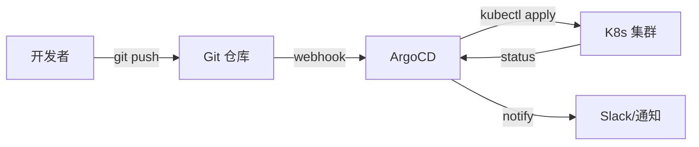

## 架构概述

GitOps 以 Git 仓库为唯一真实来源，通过声明式配置和自动同步实现持续部署。

## 架构图

## 核心组件

| 组件 | 职责 |
|------|------|
| Git 仓库 | 声明式配置存储 |
| ArgoCD | 监听仓库变更，自动同步 |
| Kustomize/Helm | 配置模板化 |
| Image Updater | 自动更新镜像版本 |

## 设计决策

- ArgoCD vs FluxCD：ArgoCD UI 好，FluxCD 轻量
- 单向同步（Git → 集群）vs 双向同步（集群变更回写 Git）？
- 多环境管理：目录分层 vs 分支分层？

## 相关页面

- [[ha-cluster]] — 高可用集群架构
- [[helm-vs-kustomize]] — Helm vs Kustomize 对比
