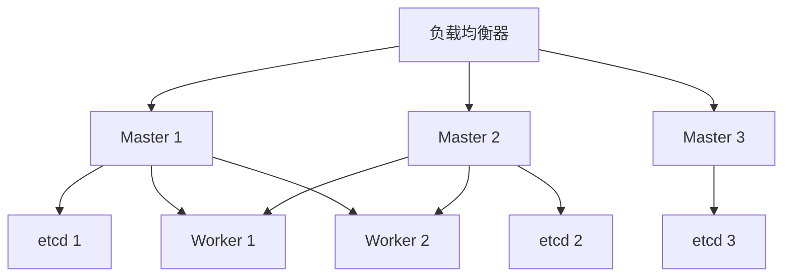

## 架构概述

Kubernetes 高可用集群通过多 Master 节点 + etcd 集群实现控制面冗余。

## 架构图

## 核心组件

| 组件 | 职责 | 高可用方案 |
|------|------|-----------|
| API Server | 集群入口 | 多实例 + 负载均衡 |
| etcd | 集群状态存储 | 3/5 节点 Raft 共识 |
| Scheduler | Pod 调度 | Leader 选举 |
| Controller Manager | 控制循环 | Leader 选举 |

## 设计决策

- etcd 用 3 节点（容忍 1 节点故障）还是 5 节点（容忍 2 节点故障）？
- 堆叠拓扑（etcd 和 Master 同节点）vs 外部拓扑（etcd 独立节点）？
- 负载均衡器选择：HAProxy、云厂商 LB、还是 MetalLB？

## 相关页面

- [[pod-lifecycle]] — Pod 生命周期
- [[etcd-data-corruption]] — etcd 数据损坏故障
- [[gitops-pipeline]] — GitOps 部署流水线
