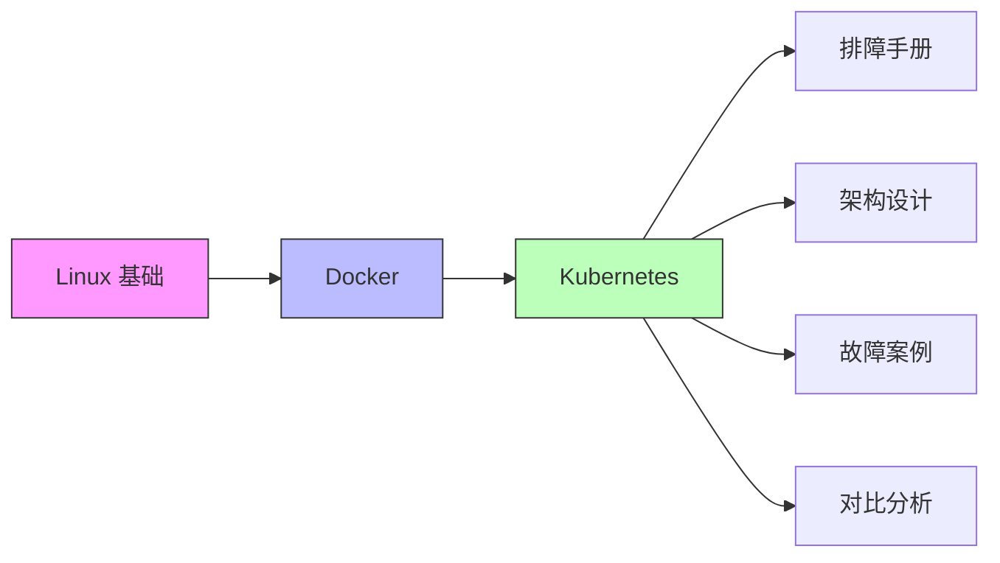

# SRE Atlas

SRE Atlas 是一个面向站点可靠性工程师（SRE）的知识图谱，涵盖从操作系统基础到云原生架构的完整学习路径。所有内容以中文撰写，技术术语保留英文原文。

## 分类索引

| 分类 | 说明 | 入口 |
|------|------|------|
| Linux 基础 | 进程模型、文件系统、网络栈、systemd | [[linux/index\|Linux 基础]] |
| Docker | 镜像分层、网络、存储、Compose | [[docker/index\|Docker]] |
| Kubernetes | Pod 生命周期、容器运行时、Service Mesh | [[kubernetes/index\|Kubernetes]] |
| 排障手册 | CrashLoopBackOff、OOMKilled、ImagePullBackOff | [[runbooks/index\|排障手册]] |
| 架构设计 | 高可用集群、GitOps 流水线 | [[architectures/index\|架构设计]] |
| 故障案例 | etcd 数据损坏、DNS 解析失败 | [[incidents/index\|故障案例]] |
| 对比分析 | Helm vs Kustomize、Istio vs Linkerd | [[comparisons/index\|对比分析]] |

## 学习路径

建议按顺序学习：Linux 基础 -> Docker -> Kubernetes，然后根据实际需求深入排障手册、架构设计、故障案例和对比分析。

## 数据来源

本知识库的内容持续从以下来源整理和更新：

- **RSS 订阅**：Kubernetes 官方博客、CNCF 博客、Linux Foundation 更新
- **GitHub**：Kubernetes、containerd、etcd 等核心项目的 Issue 和 PR
- **官方文档**：Kubernetes Docs、Docker Docs、systemd 文档
- **社区资源**：SRE Weekly、KubeWeekly、CloudNative Digest

## 标签体系

所有页面使用以下标签进行分类：

| 标签 | 含义 |
|------|------|
| `linux` | Linux 系统相关 |
| `docker` | Docker 容器相关 |
| `kubernetes` | Kubernetes 编排相关 |
| `troubleshooting` | 排障相关 |
| `architecture` | 架构设计相关 |
| `incident` | 故障案例相关 |
| `comparison` | 技术对比相关 |
| `beginner` | 入门级内容 |
| `advanced` | 进阶内容 |
